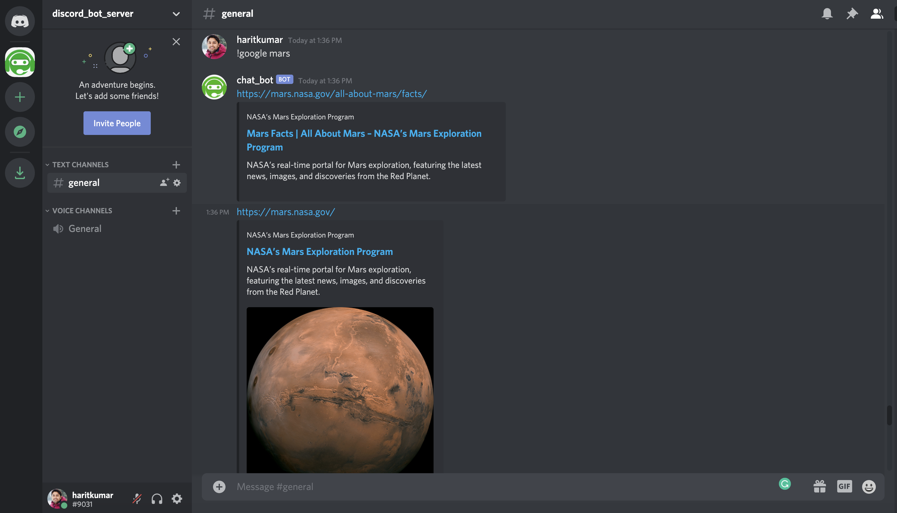

# discord chat bot service
This service receives messeges sent on discord channel and process them as bot user's response.

- Bot name `chat_bot`
- Bot URL to add into the server `https://discord.com/api/oauth2/authorize?client_id=814373294290632714&permissions=0&scope=bot`

## How to use
```sh
# for google search (it return top 5 results from google search)
!google games
!google apple games
!google nodejs
!google pokemon
!google mars

# User history search
!recent game
!recent nodejs
```




## Install python dependencies
```sh
python3 -m pip install -r requirements.txt
```

## Run program
```sh
python3 main.py
```

## DB to persist search history
We are using mysql for persistence. We can use other dbs as well like Mongo, Elastic search for better performance

- check `db_script.sql`

- Note: Use Python 3.7